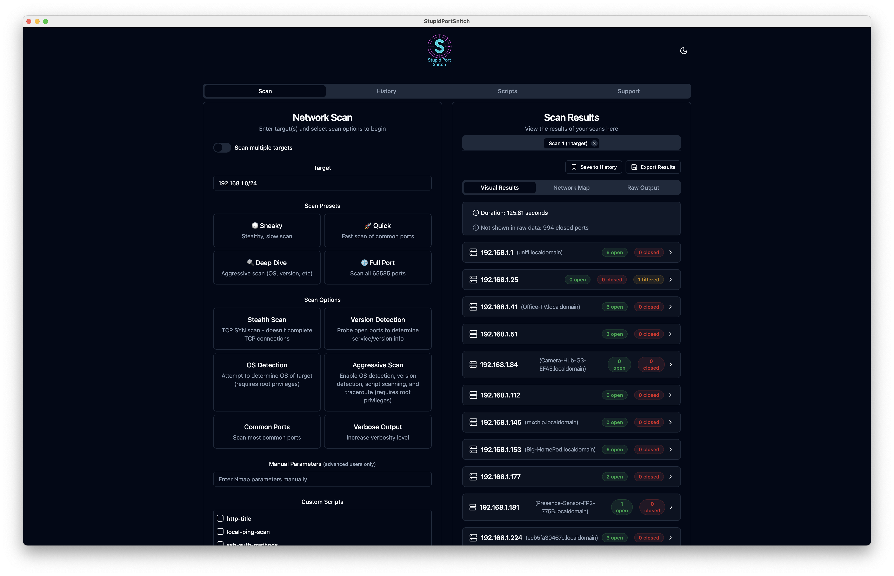
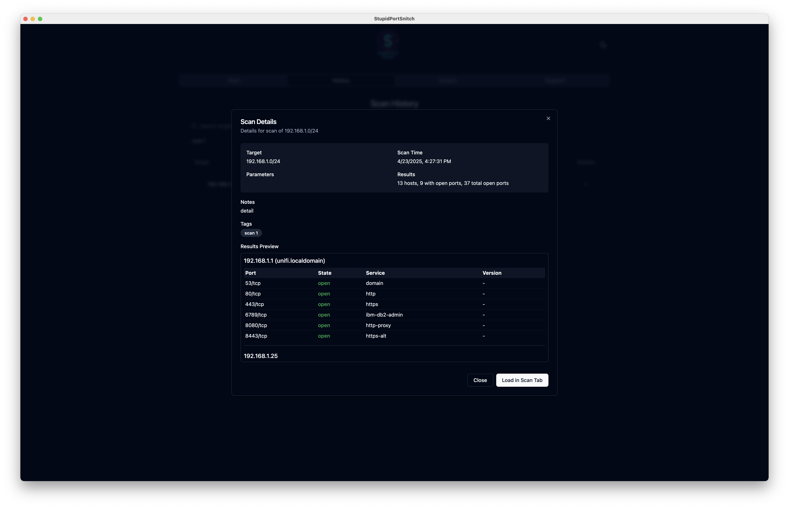
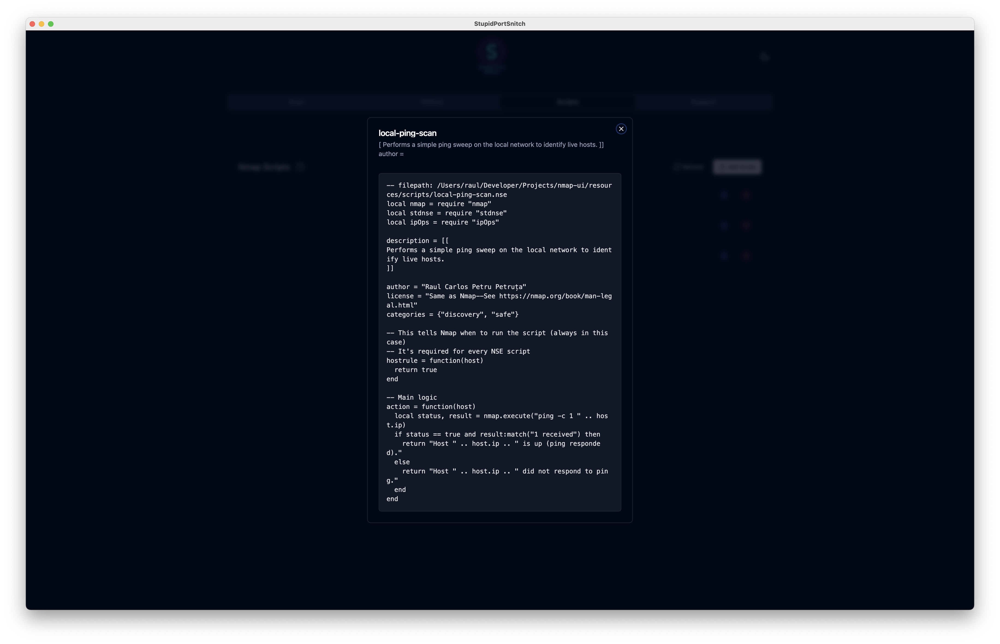
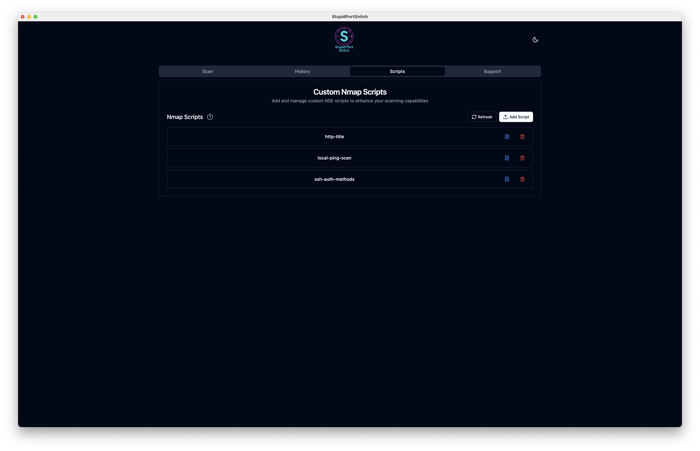
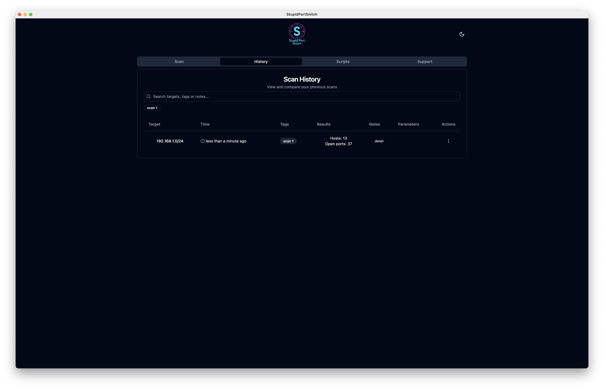
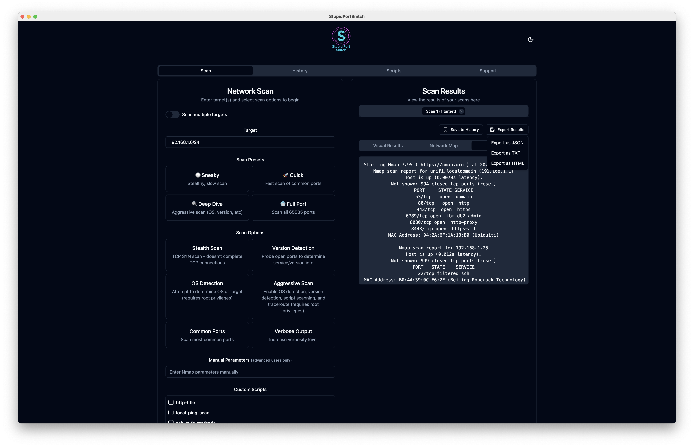
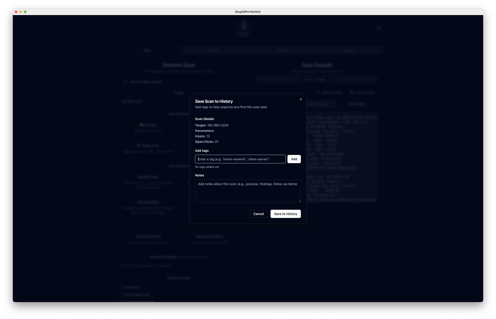
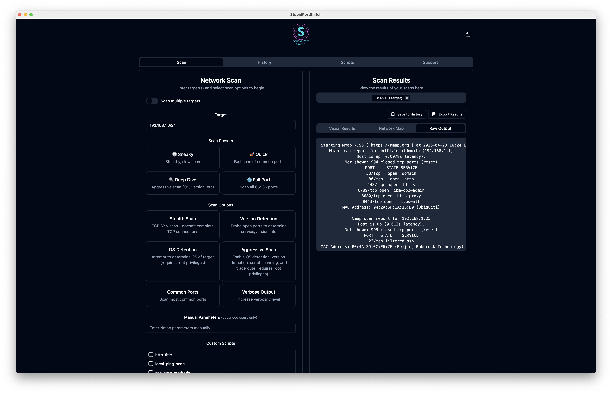
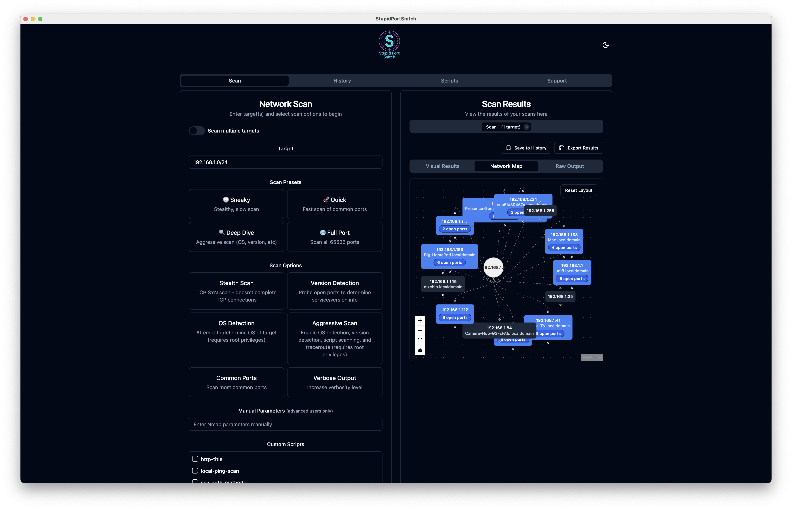

# Stupid Port Snitch

A desktop application for running Nmap network scans with a modern user interface, so even your grandma can scan ports (please don’t let her).
Built with Electron, React, TypeScript, and Tailwind CSS

## Platform Support & Downloads

Stupid Port Snitch is available for:

-  macOS
-  Linux
-  Windows

Download the latest version from the [Releases](https://github.com/raulpetruta/stupidportsnitch/releases) page.

## Prerequisites

- Node.js (v16 or higher)
- npm (v7 or higher)
- Nmap installed on your system
  - macOS: `brew install nmap`
  - Linux: `sudo apt-get install nmap`
  - Windows: Download from [nmap.org](https://nmap.org/download.html)

## Installation

1. Clone the repository:

```bash
git clone https://github.com/raulpetruta/stupidportsnitch.git
cd stupidportsnitch
```

2. Install dependencies:

```bash
npm install
```

## Development

To run the application in development mode:

```bash
npm run electron:dev
```

## Building

To build the application for your platform:

```bash
npm run electron:build
```

The built application will be available in the `release` directory.

## Features

- Modern, responsive UI with dark mode support
- Simple and intuitive interface for running Nmap scans
- Real-time scan results display
- Cross-platform support (macOS, Linux, Windows)
- Scan Multiple Targets simultaneously
- Detailed Service Detection
- Advanced Scan Presets for different scanning scenarios
- Interactive Network Map visualization (Visual Feature)
- Export Results in various formats
- Scan History with Tags for better organization
- Passive Vulnerability Lookup
- Custom NSE Scripts support - drop in your own Nmap scripts
- Theme switching between light and dark modes

## Screenshots



















## Usage

1. Launch the application
2. Enter the target IP address or hostname in the input field
3. Click "Start Scan" to begin the scan
4. View the results in the results section below

## Support this project

[](https://buymeacoffee.com/raulpetruta)

[](https://paypal.me/raulpetruta98)

[](https://revolut.me/petrutaraul)

## License

MIT
